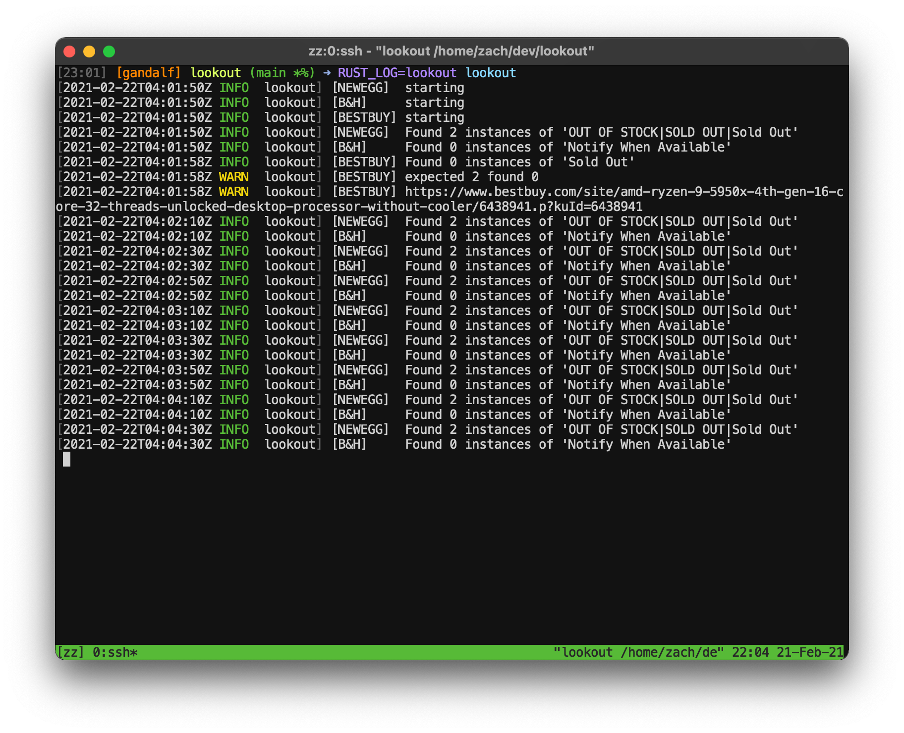

Lookout
=======

An asynchronous scraper utility. Given a TOML file describing sites, selectors, regex, and expected
regex matches, this will continuously scrape and call/text your phone using Twilio when expected
matches are not met (if configured).

For example, this could scrape for product stock and call you when the expected 'out of stock'
elements on the page are no longer found.



Installation
------------

```bash
cargo install lookout
```

Usage
-----
By default, lookout will load `lookout.toml` from the directory from which it is run.
```
lookout
```

You can optionally pass a single argument specifying a path to the config file.
```
lookout ~/my-lookout.toml
```

If you are deploying on a server and would like to print logs, set the environment variable `RUST_LOG=lookout`.
```
RUST_LOG=lookout lookout
```

In order to debug the scrapers, turn on `log` in the configuration and run with `RUST_LOG=lookout`.

DISCLAIMER: Always abide by limits/regulations when scraping. The example below is for illustrative
purposes only.

### Example
```toml
log = false

# in seconds
error_delay = 300 # timeout 5 minutes after error
alert_delay = 300 # timeout 5 minutes after an alert

# upper bound on errors to prevent unbounded retries
allowed_errors = 20 

# twilio configuration
[twilio]
enable_call = true
enable_text = true
id = XXXXXXXXXXXXXXXX
auth = XXXXXXXXXXXXXXXX
to_phone = +10123456789
from_phone = +10123456789
default_callback = "https://<callback-url>"

# define a [[lookout]] block for each scraper
# required:
# - name
# - url
# - regex to search for
# - number of expected matches
# - timeout after each request
# optional:
# - list of selectors which will be used to filter the html
# - headers (see below)
[[lookout]]
name = "newegg"
url = "https://www.newegg.com/product"
regex = "OUT OF STOCK|SOLD OUT|Sold Out"
expected_matches = 3
selectors = [ "#app > div.page-content > div.page-section > div > div > div.row-side > div.product-buy-box",
              "#app > div.page-content > div.page-section > div > div > div.row-body > div.product-main.display-flex > div
timeout = 180

[[lookout]]
name = "b&h"
url = "https://www.bhphotovideo.com/some/cool/product"
regex = "Notify When Available"
expected_matches = 1
timeout = 180

[[lookout]]
name = "bestbuy"
url = "https://www.bestbuy.com/site/something/"
regex = "Sold Out"
expected_matches = 2
timeout = 180

# optionally, add custom request headers for the scraper above
[lookout.headers]
"User-Agent" = "Wget/1.20.1 (linux-gnu)"
"Accept-Encoding" = "identity"
"ACCEPT" = "*/*"
"Connection" = "Keep-Alive"
```
